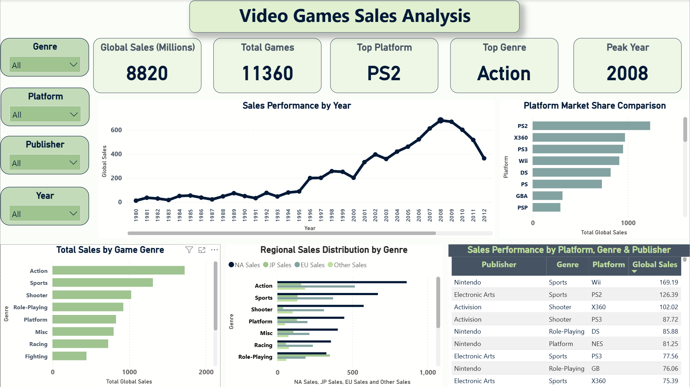

# video-game-sales-analysis
Excel analysis + Power BI dashboard for global video game sales
# 🎮 Video Game Sales Analysis

## 📌 Project Overview
This project analyzes historical global video game sales data to identify market growth patterns, peak performance years, platform dominance, genre contribution, and regional impact.

The objective is to extract business-level insights using Excel for data analysis and Power BI for visualization.

---

## ❓ Key Business Questions
- When did the video game market experience major growth phases?
- What caused the 2008 market peak?
- Which platforms dominated during the growth era (2001–2008)?
- Which genres drove the expansion?
- Which region contributed most to total sales?

---

## 📊 Key Insights

### 1️⃣ Market Growth Phases
The industry experienced two major growth periods:
- 1995–1998 (early expansion)
- 2001–2008 (major expansion ending with the 2008 peak)

### 2️⃣ Platform Competition
The 2008 peak was not driven by a single platform. Strong competition between PS2, Wii, Xbox 360, PS3, and DS created a diversified and expanding ecosystem.

### 3️⃣ Genre Contribution
Action was the top-performing genre overall. However, Sports titles showed strong growth in 2006, demonstrating that multiple genres contributed to sustained expansion.

### 4️⃣ Regional Impact
North America was the largest contributor to total sales, especially during peak years, though the growth was globally supported by Europe and other regions.

---

## 🛠 Tools Used
- Microsoft Excel (Data Cleaning & Pivot Analysis)
- Power BI (Dashboard & Visualization)

---

## 📈 Dashboard Preview

